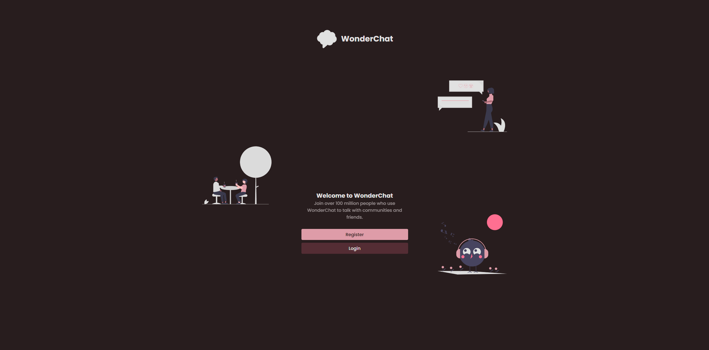
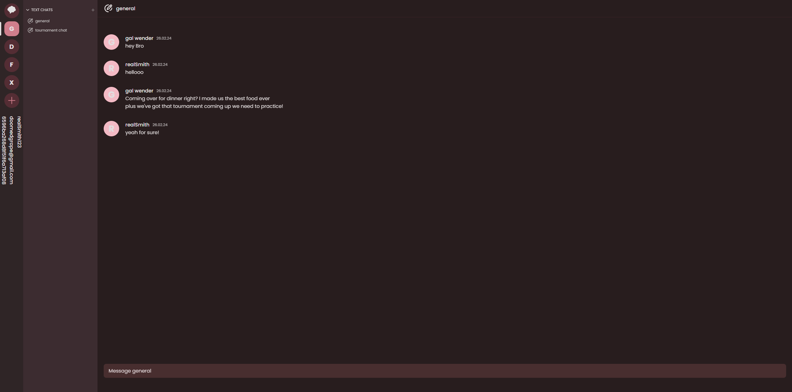

# WonderChat
This is a chat app influenced by the chat app Discord. Currently i am sunsetting this project 

# Things i could have done but didn't
- fix some registration bugs
- implement direct messages
- added voice notes
- added an option to send images
- added profile pictures
- some socket.io fixes for live updates
- interactive 3D homepage using three.js
- Ui adjustments
- added private routes and JWT token for security
- added useContext and createContext that i recently learned
- added some little optimization with useCallback and useMemo (even more than what i already have)

# Installation
- Make sure to do this for both the frontend and backend repositories.

1. Clone the repository:

    ```bash
    git clone <repository-url>
    ```

2. Install dependencies:

    ```bash
    npm install
    ```

3. Run the project:

    ```bash
    npm run dev
    ``` 

## Screenshots



